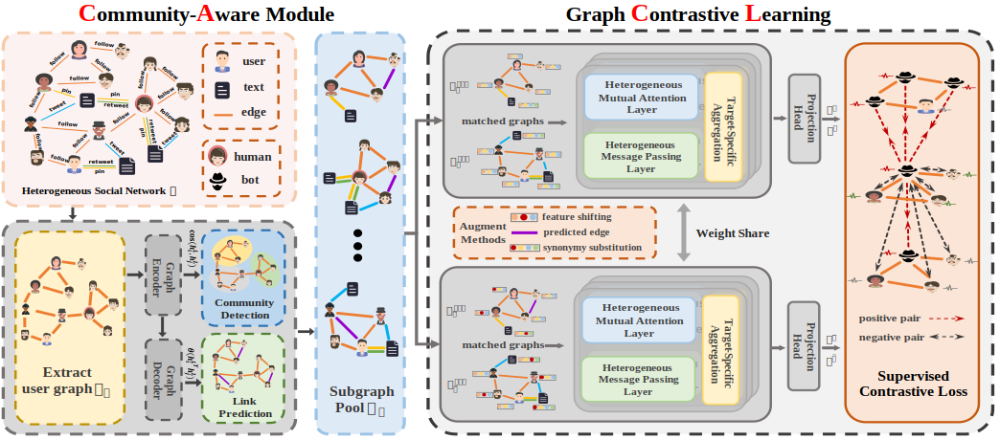

### CACL: Community-Aware Heterogeneous Graph Contrastive Learning for Social Media Bot Detection

>Accepted by ACL 2024 Findings

- I have released the source code of this project at [[github]](https://github.com/SirryChen/CACL).

- And the pre-print version has been released on [[arxiv]](https://arxiv.org/abs/2405.10558).

- I sincerely appreciate all the help and support from my teachers, seniors, and classmates.

The following PDF is the PPT I used during my defense, which can serve as a good summary of the entire project.

<iframe src="../file/陈思远-答辩PPT.pdf" width="100%" height="600px"></iframe>

 

