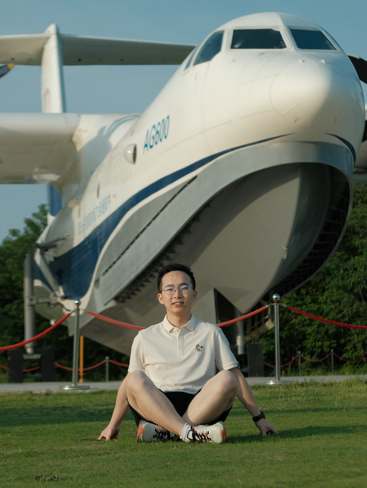

# About Me

Here is **Sirry Chen(陈思远)**.

I am a junior undergrad majoring in **AI** at Nanjing University of Aeronautics and Astronautics, Changkong College. My academic advisor is [Prof. Piji Li](https://lipiji.com/){:target="_blank"}. My research interests are large language model, graph learning, natural language learning, and data mining. 

If you are interested in any aspect of me, I would like to chat and collaborate, please email me at *sirrychen[at]nuaa[dot]edu[dot]cn*

## Academic Background

- **Sep 2021 - Future：** Nanjing University of Aeronautics and Astronautics
- **Sep 2018 - June 2021:** Chongqing High School in Chongzhou City Sichuan Province

---

## News and Updates

- 🔥 My first paper CACL is accepted by ACL 2024 Findings [[*blog*]](/blogs/2024-05-17-CACL/)

<!-- Google tag (gtag.js) -->

<!-- 谷歌网站分析 -->