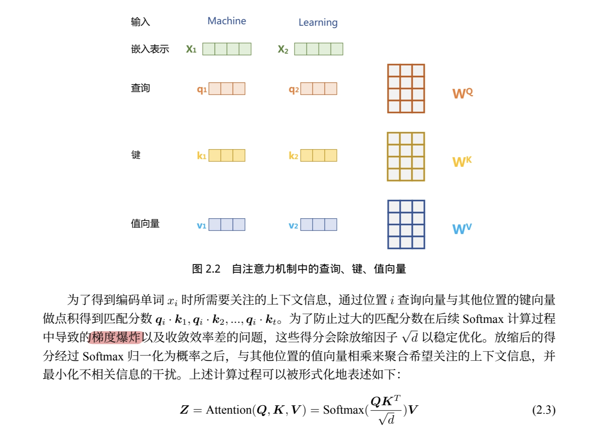
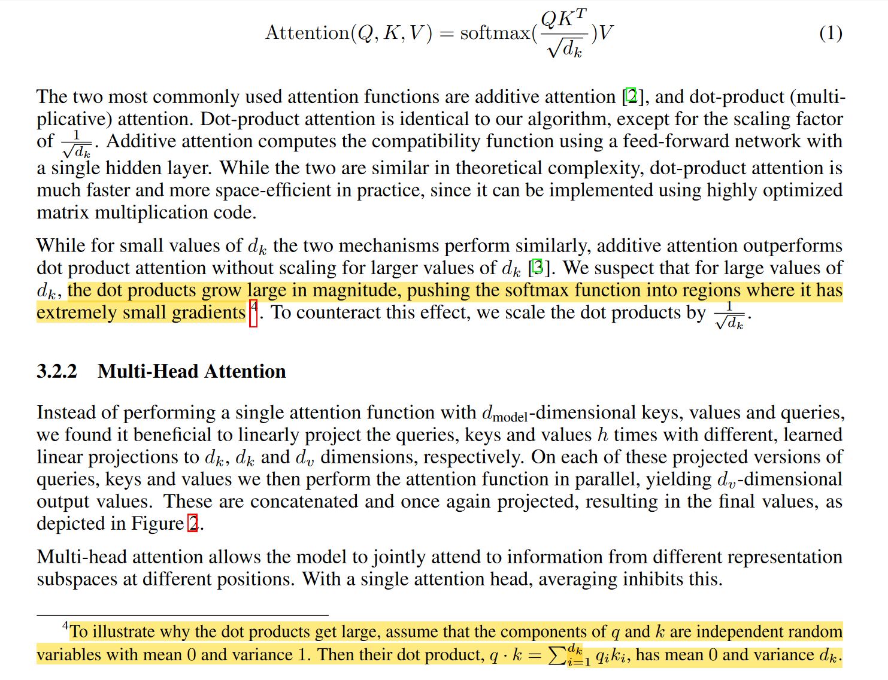

### 1. 问题描述
《大规模语言模型：从理论到实践》第16页，“为防止{\ast}{\ast}过大的匹配分数{\ast}{\ast}在后续Softmax计算过程中导致的{\ast}{\ast}梯度爆炸{\ast}{\ast}以及收敛效率差的问题，这些得分会除{\ast}{\ast}缩放因子{\ast}{\ast}$\sqrt{d}$ 以稳定优化。”

{\ast}{\ast}原文等价于{\ast}{\ast}: $\sqrt{d}$ 的作用为缩减$\mathbf{Q}\mathbf{K}^T$ 中元素值的大小，防止在梯度反向传播时导致的梯度爆炸问题。

### 2. $\sqrt{d}$ 的作用应该是防止梯度消失

使用与书中相同的记号

$$
    \operatorname{Attention}(\mathbf{Q}, \mathbf{K}, \mathbf{V})=\operatorname{Softmax}(\frac{\mathbf{QK}^T}{\sqrt{d}})\mathbf{V},
$$

并定义

$$
\mathbf{W}^{\ast}=\frac{\mathbf{QK}^T}{\sqrt{d}},
\mathbf{W}=\operatorname{Softmax}(\mathbf{W^{\ast}}),
$$

其中矩阵$\mathbf{W}$中的元素 $W_{ij}=\frac{e^{W^{\ast}_{ij}}}{\sum^{d}_{p=1}e^{W^{\ast}_{ip}}}$ 。

#### 2.1 去除$\sqrt{d}$ 项会使得变量$W^{\ast}_{ij}$ 的方差增大
由之前定义可知矩阵$\mathbf{W}^{\ast}$ 中元素$$W^{\ast}_{ij}=\frac{\mathbf{Q}_i\mathbf{K}_i^T}{\sqrt{d}}=\sum^d_{j=1}\frac{Q_{ij}K_{ij}}{\sqrt{d}}$$ ，
此时假设变量$Q_{ij},K_{ij}$ 均服从标准正态分布且互相独立，即$Q_{ij},K_{ij}\sim N(0, 1)$ ，则变量$W^{\ast}_{ij}\sim N(0,1)$。

若去除$\sqrt{d}$ 项，即$W^{\ast}_{ij}=\mathbf{Q}_i\mathbf{K}_i^T=\sum^d_{j=1}Q_{ij}K_{ij}$ ，则$W^{\ast}_{ij}\sim N(0,d)$ ，此时方差增大，即$\mathbf{W}^{\ast}$ 矩阵中元素之间的差异增大。

#### 2.2 变量$W^{\ast}_{ij}$ 的方差增大会使得梯度值偏小

在反向传播过程中，会涉及到对$\operatorname{Softmax}$项进行求导，对于 $\mathbf{W}^{\ast}$ 中的某一个元素 $W^{\ast}_{ij}$ ，求偏导如下

$$
\begin{gather}
\frac{\partial \operatorname{Softmax}(W^{\ast}_{ij})}{\partial W^{\ast}_{ij}} = \operatorname{Softmax}(W^{\ast}_{ij})(1-\operatorname{Softmax}(W^{\ast}_{ij})) \tag{1}\\
\frac{\partial \operatorname{Softmax}(W^{\ast}_{ij})}{\partial W^{\ast}_{ip}} = -\operatorname{Softmax}(W^{\ast}_{ip})\operatorname{Softmax}(W^{\ast}_{ij}), p\neq j\tag{2}
\end{gather}
$$

这个$W^{\ast}_{ij}$ 可以？
若变量$W^{\ast}_{ij}$ 的方差增大，则考虑元素$W^{\ast}_{ij}$ 远大于其他元素$W^{\ast}_{ip}$ 的情况，则$\operatorname{Softmax}(W^{\ast}_{ij})$ 趋近于1，而$\operatorname{Softmax}(W^{\ast}_{ip})$ 趋近于0
- 对于式（1），$1-\operatorname{Softmax}(W^\{\ast}_{ij})$ 趋近于0，使得$\frac{\partial \operatorname{Softmax}(W^\{\ast}_{ij})}{\partial W^\{\ast}_{ij}}$趋近于0
- 对于式（2），$\operatorname{Softmax}(W^\{\ast}_{ip})$ 趋近于0，使得$\frac{\partial \operatorname{Softmax}(W^\{\ast}_{ij})}{\partial W^\{\ast}_{ip}}$ 趋近于0

反之亦然。所以当变量$W^{\ast}_{ij}$ 的方差较大时，梯度值会整体偏小。

#### 2.3 归纳

丢弃$\sqrt{d}$ 项会使得变量$W^{\ast}_{ij}$ 的方差增大，而变量$W^{\ast}_{ij}$ 的方差增大会使得梯度值偏小，进而引发梯度消失问题。

真正解决梯度爆炸问题的应该是$\operatorname{Softmax}$函数，它直接进行了归一化的操作，避免值过大导致的梯度爆炸问题。而正是因为使用了$\operatorname{Softmax}$函数，引入了变量方差过大会导致梯度消失的问题，所以需要对变量进行除$\sqrt{d}$操作降低方差。

### Ref

1. 参考“[Attention Is All You Need](https://arxiv.org/abs/1706.03762)”原文，较大的$d$会导致点积的增大，进而在计算softmax函数时被推向较小梯度的区域（说的比较含糊，脚注中解释从方差影响的角度进行说明）

2. [知乎：Transformer学习笔记二：Self-Attention（自注意力机制）](https://zhuanlan.zhihu.com/p/455399791)
3. [知乎提问：transformer中的attention为什么scaled?](https://www.zhihu.com/question/339723385/answers/updated)

